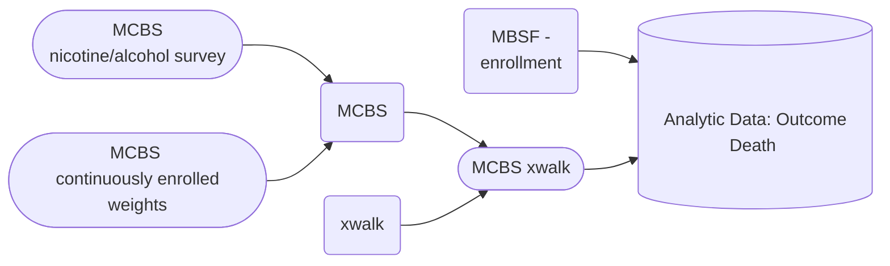
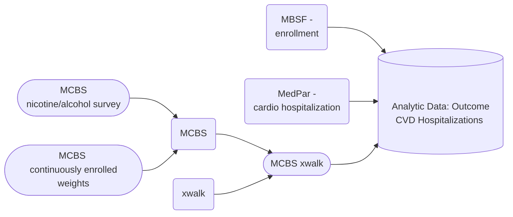
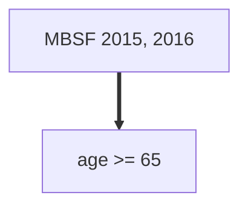
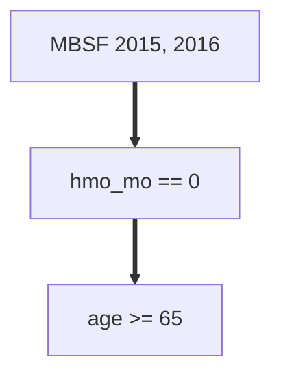

## MCBS Data Merged with MBSF Data
Here we create two datasets, the first one a larger dataset (n=89,402,863 person-years) with the primary outcome of death (n=3,929,413) as reported by MBSF, and including the MCBS cohort information from 2015. The second dataset is slightly smaller (n=58,820,353 person-years) with the primary outcome of CVD hospitalization as reported by MedPar (n=8,186,915 person-years with CVD events)--this dataset contains a subset of individuals from the first dataset, subsetted based on the criteria that they were not enrolled in the HMO plan of Medicare during 2015-2016.

We used the MBSF data from 2015 and 2016 (the 2016 MBSF data was subsetted to just the individuals that were also enrolled in 2015). Similarly, the MedPar data for 2015 and 2016 was used, matched to the MBSF data. MCBS data for 2015 was used, and it attached to its corresponding individual from MBSF, so the same MCBS survey result may be in two rows of the data (the individual in 2015 and in 2016, if applicable).

#### Dataset: MBSF, MCBS; Outcome: Death

#### Dataset: MBSF, MedPar, MCBS; Outcome: CVD Hospitalization

### MCBS xwalk
Combined nicoalco.csv and cenwgts.csv to get weights and restrict to beneficiaries continuously enrolled

The weight variable is named `CS1YRWGT` and there are 100 replicate weights for variance estimation named `CS1YR001,CS1YR002,CS1YR003,...,CS1YR100`.

Columns: `BASEID,SURVEYYR,VERSION,EVERSMOK,SMOKNOW,DIDSMOKE,LASTSMOK,HAVSMOKE,DRQTSMOK,QUITSMOK,DRINKDAY,DRINKSPD,FOURDRNK,CS1YRWGT,CS1YR001,CS1YR002,CS1YR003,..., CS1YR100,QID`

| BASEID | SURVEYYR | ... | QID |
|--------|----------|-----|-----|
| ABC    |          |     | 123 |

We have only selected the MCBS results from 2015 because the MCBS surveys went through a major design overhaul to include more detailed nicotine and alcohol questions starting in 2015. Please note that there are several questions that ascertain the duration of drinking and smoking, but that the questionnaires follow certain patterns in which certain questions are only asked under certain logical scenarios, so the number of responses is low. For more information about the MCBS survey questions, please consult the data dictionary in the data folder.

### Medpar cardio hospitalization

Columns: `QID,ADATE,YEAR,cardio`

| QID | ADATE | YEAR | cardio |
|-----|----------|-----|-----|
| 123 |          |  2015 | True |
| 123 |          |  2016 | True |

### MBSF 

Columns: `"zip","year","qid","dodflag","bene_dod","sex","race","age","hmo_mo","hmoind","statecode","latitude","longitude","dual","death","dead","entry_age","entry_year","entry_age_break","followup_year","followup_year_plus_one","pm25_ensemble","pm25_no_interp","pm25_nn","ozone","ozone_no_interp","zcta","poverty","popdensity","medianhousevalue","pct_blk","medhouseholdincome","pct_owner_occ","hispanic","education","population","zcta_no_interp","poverty_no_interp","popdensity_no_interp","medianhousevalue_no_interp","pct_blk_no_interp","medhouseholdincome_no_interp","pct_owner_occ_no_interp","hispanic_no_interp","education_no_interp","population_no_interp","smoke_rate","mean_bmi","smoke_rate_no_interp","mean_bmi_no_interp","amb_visit_pct","a1c_exm_pct","amb_visit_pct_no_interp","a1c_exm_pct_no_interp","tmmx","rmax","pr","cluster_cat","fips_no_interp","fips","summer_tmmx","summer_rmax","winter_tmmx","winter_rmax"`

| QID | YEAR | ... |
|-----|------|-----|
| 123 |  2015 |     |
| 123 |  2016 |     |

Included in the datasets are the MBSF 2015 beneficiaries, as well as the 2016 beneficiaries, if they were also enrolled in 2015.

## Final analytic dataset
Note that many Medicare beneficiaries did not participate in MCBS, so there will be some NULL values in the MCBS columns. Additionally, the MedPar columns are only for CVD events, so if an individual does not have a record of a CVD event in MedPar in 2015 or 2016, the respective columns will be null.

| QID | MedPar 2015 | MedPar 2016 | MCBS_2015 | MCBS_2015 Weights | MBSF 2015 | MBSF_2016 |
|-----|-------------|-------------|-----------|-------------------|-----------|-----------|
| 1   |             |             |           |                   |           |           |
| 2   |             |             |           |                   |           |           |
| 3   |             |             |           |                   |           |           |

### Pre-selection
Dataset: Outcome Death

Dataset: Outcome CVD Hospitalizations

## Performing Preliminary EDA

**Analysis Folder:**

`eda.R` uses the 2015 MCBS data restricted to the 2015 baseline panel (people who enrolled in the MCBS surveys in 2015), produces plots with several key variables such as age, drinks per day, etc. 

`eda_all_four_panels.R` replicates eda.R, but instead uses all four panels (people who enrolled in MCBS in 2012, 2013, 2014, and 2015)

`mcbs_mbsf_merge.ipynb` merges the 2015 MCBS with the 2015 and 2016 MBSF files and creates `mcbs_demo_x_mbsf_15-16.csv` and `mcbs_nicoalco_x_mbsf_15-16.csv` in the data folder which are restricted to ages 65+ and 2015 baseline MCBS enrollees, shows the number of deaths in 2015/2016

`mcbs_mbsf_merge-all-panels.ipynb` is a replicate of `mcbs_mbsf_merge.ipynb`, but it does not restrict the panel to 2015 and it produces `mcbs_demo_x_mbsf_15-16_allpanels.csv` and `mcbs_nicoalco_x_mbsf_15-16_allpanels.csv` in the data folder, shows the number of deaths in 2015/2016

**Data Folder:**

Final Outputs folder: contains the merged files in fst and csv formats. For the outcome of mortality, please use the file: `mbsf_mcbs_2015_2016.csv/fst`
For the outcome of CVD hospitalizations, please use the file `mbsf_medpar_mcbs_2015_2016.csv/fst`. FST files load quickly in R, but they don't work in Python. In R, you can use the fst library from CRAN to quickly load the data.

`mcbs_medpar_mbsf_2015-2016.fst` is the full merged file with 2015 MCBS nicotine alcohol survey/continuous weights, 2015 & 2016 MedPar CVD events, and 2015 & 2016 MBSF denominator data, restricted to age 65+ and non-HMO, in fst format for faster loading using library(fst) and read_fst() in R

`mcbs_medpar_mbsf_2015-2016.csv` is the same as the above `mcbs_medpar_mbsf_2015-2016.fst`, but in CSV format to be accessible outside of R

`mcbs_xwalk.csv` combines the MCBS 2015 nicotine and alcohol survey and continuously enrolled beneficiaries and contains both the MCBS BASEIDs and their correspending QIDs

`mcbs_demo_x_mbsf_15-16.csv` combines data from the 2015 MCBS demographic file restricted to 2015 enrollees with the 2015 & 2016 MBSF denominator file

`mcbs_nicoalco_x_mbsf_15-16.csv` combines data from the 2015 MCBS nicotine and alcohol file restricted to 2015 enrollees with the 2015 & 2016 MBSF denominator file

`mcbs_demo_x_mbsf_15-16_allpanels.csv` combines data from the 2015 MCBS demographic file with the 2015 & 2016 MBSF denominator file; includes 2012-2015 panels

`mcbs_nicoalco_x_mbsf_15-16_allpanels.csv` combines data from the 2015 MCBS nicotine and alcohol file with the 2015 & 2016 MBSF denominator file; includes 2012-2015 panels

Note: A panel is the incoming cohort to the MCBS survey. Each year includes four panels of participants. The baseline panel is the panel which enters into the MCBS study that year (eg the baseline 2015 panel is the group of Medicare beneficiaries that enter MCBS in 2015). 
