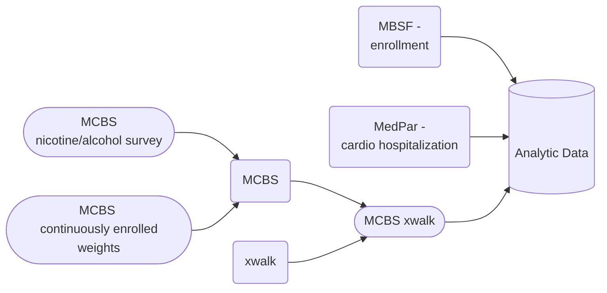
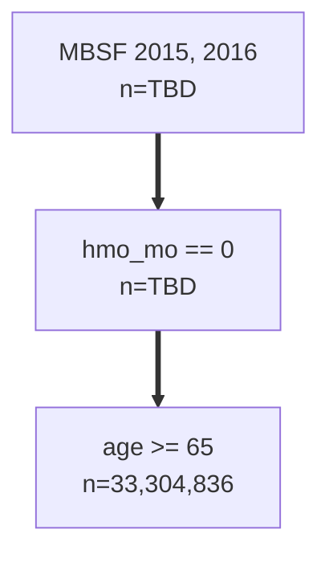

## MCBS Data Merged with MBSF Data

### MCBS xwalk
Combined nicoalco.csv and cenwgts.csv to get weights and restrict to beneficiaries continuously enrolled

The weight variable is named `CS1YRWGT` and there are 100 replicate weights for variance estimation named `CS1YR001,CS1YR002,CS1YR003,...,CS1YR100`.

Columns: `BASEID,SURVEYYR,VERSION,EVERSMOK,SMOKNOW,DIDSMOKE,LASTSMOK,HAVSMOKE,DRQTSMOK,QUITSMOK,DRINKDAY,DRINKSPD,FOURDRNK,CS1YRWGT,CS1YR001,CS1YR002,CS1YR003,..., CS1YR100,QID`

| BASEID | SURVEYYR | ... | QID |
|--------|----------|-----|-----|
| ABC    |          |     | 123 |

### Medpar cardio hospitalization

Columns: `QID,ADATE,YEAR,cardio`

| QID | ADATE | YEAR | cardio |
|-----|----------|-----|-----|
| 123 |          |  2015 | True |
| 123 |          |  2016 | True |

### MBSF 

Columns: `"zip","year","qid","dodflag","bene_dod","sex","race","age","hmo_mo","hmoind","statecode","latitude","longitude","dual","death","dead","entry_age","entry_year","entry_age_break","followup_year","followup_year_plus_one","pm25_ensemble","pm25_no_interp","pm25_nn","ozone","ozone_no_interp","zcta","poverty","popdensity","medianhousevalue","pct_blk","medhouseholdincome","pct_owner_occ","hispanic","education","population","zcta_no_interp","poverty_no_interp","popdensity_no_interp","medianhousevalue_no_interp","pct_blk_no_interp","medhouseholdincome_no_interp","pct_owner_occ_no_interp","hispanic_no_interp","education_no_interp","population_no_interp","smoke_rate","mean_bmi","smoke_rate_no_interp","mean_bmi_no_interp","amb_visit_pct","a1c_exm_pct","amb_visit_pct_no_interp","a1c_exm_pct_no_interp","tmmx","rmax","pr","cluster_cat","fips_no_interp","fips","summer_tmmx","summer_rmax","winter_tmmx","winter_rmax"`

| QID | YEAR | ... |
|-----|------|-----|
| 123 |  2015 |     |
| 123 |  2016 |     |

## Final analytic dataset

MBSF x MedPar should be merged on both `QID` and `YEAR`.

|MBSF cols | MBSF cols | MedPar cols | MedPar cols | MCBS cols |
|-----|------|--------|--------|------|
| QID | YEAR | ADATE | cardio | ... |
| 123 |  2015 |     | True | |
| 123 |  2016 |     | True | |
| xyz |  2016 |     | True/False | |

### Pre-selection

Filtered MBSF 2015/2016 to columns: `
## Performing Preliminary EDA

**Analysis Folder:**

`eda.R` uses the 2015 MCBS data restricted to the 2015 baseline panel (people who enrolled in the MCBS surveys in 2015), produces plots with several key variables such as age, drinks per day, etc. 

`eda_all_four_panels.R` replicates eda.R, but instead uses all four panels (people who enrolled in MCBS in 2012, 2013, 2014, and 2015)

`mcbs_mbsf_merge.ipynb` merges the 2015 MCBS with the 2015 and 2016 MBSF files and creates `mcbs_demo_x_mbsf_15-16.csv` and `mcbs_nicoalco_x_mbsf_15-16.csv` in the data folder which are restricted to ages 65+ and 2015 baseline MCBS enrollees, shows the number of deaths in 2015/2016

`mcbs_mbsf_merge-all-panels.ipynb` is a replicate of `mcbs_mbsf_merge.ipynb`, but it does not restrict the panel to 2015 and it produces `mcbs_demo_x_mbsf_15-16_allpanels.csv` and `mcbs_nicoalco_x_mbsf_15-16_allpanels.csv` in the data folder, shows the number of deaths in 2015/2016

**Data Folder:**

`mcbs_demo_x_mbsf_15-16.csv` combines data from the 2015 MCBS demographic file restricted to 2015 enrollees with the 2015 & 2016 MBSF denominator file

`mcbs_nicoalco_x_mbsf_15-16.csv` combines data from the 2015 MCBS nicotine and alcohol file restricted to 2015 enrollees with the 2015 & 2016 MBSF denominator file

`mcbs_demo_x_mbsf_15-16_allpanels.csv` combines data from the 2015 MCBS demographic file with the 2015 & 2016 MBSF denominator file; includes 2012-2015 panels

`mcbs_nicoalco_x_mbsf_15-16_allpanels.csv` combines data from the 2015 MCBS nicotine and alcohol file with the 2015 & 2016 MBSF denominator file; includes 2012-2015 panels

Note: A panel is the incoming cohort to the MCBS survey. Each year includes four panels of participants. The baseline panel is the panel which enters into the MCBS study that year (eg the baseline 2015 panel is the group of Medicare beneficiaries that enter MCBS in 2015). 
